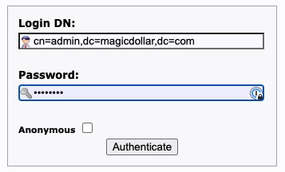
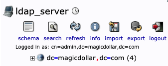
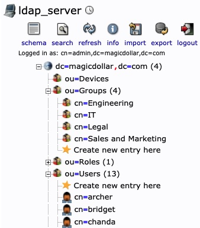

# Chapter 5: Secrets for Everyone

This directory contains files that are used for the book, "Vault in Action" chapter 5: Secrets for Everyone.

## Files

1. `Dockerfile`: this is the Dockerfile that uses the `osixia/docker-openldap` to set up an example LDAP server for a fictional company, Magic Dollar.
2. `bootstrap.ldif`: this is used by the `osixia/docker-openldap` container to pre-populate the LDAP server's data. It represents the Organizational Chart for Magic Dollar.
3. `docker-compose.yml`: this is used to coordinate running both the OpenLDAP server and the phpLDAPadmin server to manage the data in former.

## Requirements

Docker https://docs.docker.com/get-docker/

## Use

In order to spin up your own copy of the Magic Dollar OpenLDAP server, run the following command within the `chapter05` directory:

```
docker-compose up -d
```

You can view the LDAP Data Information Trees (DITs) via the phpLDAPadmin server. Open a webbrowser window and navigate to http://localhost:8090/. Login using the "Login DN" `cn=admin,dc=magicdollar,dc=com` and the `LDAP_ADMIN_PASSWORD` value found in the `docker-compose.yml` file.



After authentication, you can navigate the tree by clicking the [+] link next to `dc=magicdollar,dc=com`.



Navigate among the different DITs by clicking the [+] links next to the different groups.



